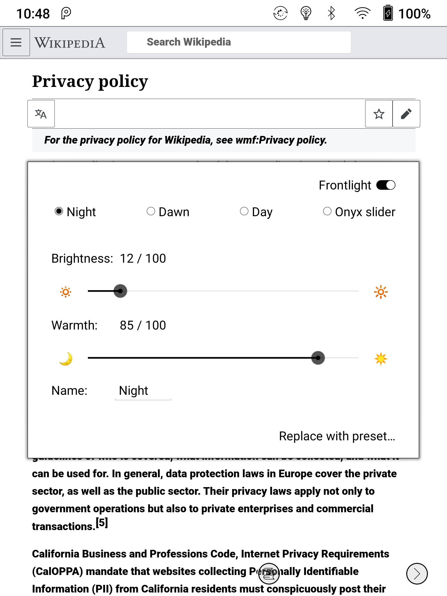
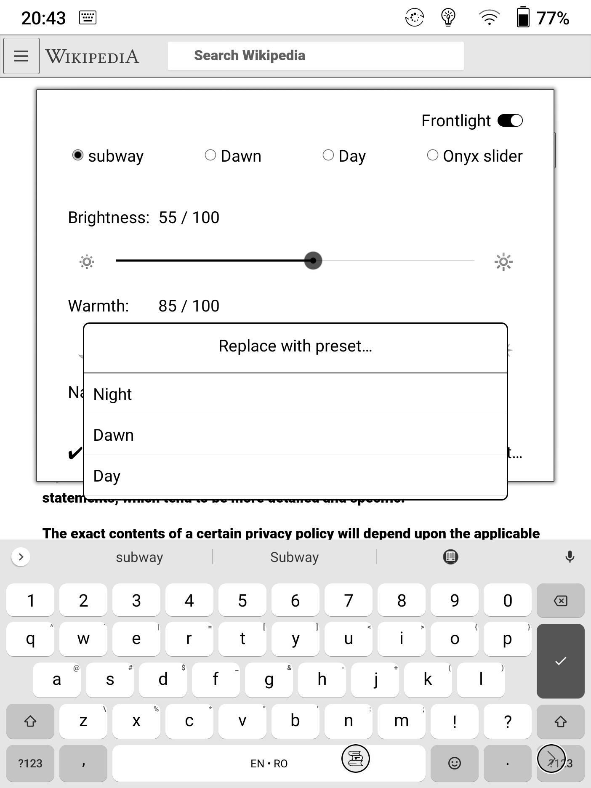

# Gentle Glow for Onyx BOOX

Adds a quick settings tile 💡 to turn the frontlight on or off on Onyx BOOX E-readers running Android 9+. 

When you turn on the light using this new quick settings tile, you can set warmth and brightness independently, instead of having to manually combine warm brightness with cold brightness.

This is like the evolution of faucets: first you have separate faucets for hot and cold water, then the interaction metaphor became navigating a 2D space where horizontal movement controls temperature and vertical movement controls flow, then you went to thermostatic faucets where you explicitly set temperature on one side and flow on the other. 
This is the thermostatic faucet for your frontlight!

## Ways you can help

If you like this app, you can help with any combination of the following:
* pick an open issue and contribute with a pull request
* let me know how you use the app - which warmth / brightness settings you use, at what times of the day.
* put any negative feedback in an issue [here on ghithub](https://github.com/calin-darie/gentle-glow-onyx-boox/issues) and give me a couple weeks to answer before you rate on Google Play. I'm doing this in my free time.
* tell your friends about it!
* rate 5 stars on Google Play - Play store release coming soon
* star this repo!
* [buy me a beer](https://paypal.me/CalinDarie?locale.x=en_US)

## Screenshots

Tap the Gentle Glow tile to turn the light on.

⚠️ With this app, you have more fine control over the frontlight than the native controls offer. Most of the time, the system controls will show the light toggles as on, but the cold / warm sliders will stay at zero, because the setting is not one of their fixed increments.

When you turn on the light using the tile, you get a dialog to choose the desired warmth and brightness.

Tap the Gentle Glow tile to turn the light back off.

You can also long press the tile to open the warmth & brightness dialog without toggling the light.

In the warmth & brightness dialog, you get to choose between three configurations. 
Initially, you get three presets:
* Night, to be used in a dark bedroom.
* Dawn, to be used at first daylight, before sunrise
* Day, to be used at day time indoors or in the shade

You can easily adjust the brightness or warmth on any of the three configurations. Just play with the sliders or with the fine tune buttons to the left and right of the sliders, and your changes are auto-saved.

Should you use the frontlight under any completely different circumstance, say on the subway, you can easily rename any of these three configurations to Subway and fine tune the warmth and brightness to your daily commute needs.
At any time, you can go back to any of the presets.

The Onyx Slider configuration is there just so changing the frontlight settings via the system sliders doesn't silently change your current configuration. 

The Onyx Slider configuration is also a good way to get your system sliders back to a known good state, see the warning above.

## License

The MIT license applies to all the files in this repository, except the light bulb icons, both store listing and quick settings tile, which are derivatives of the openmoji bulb svg by Sina Schulz https://openmoji.org/library/#search=bulb&emoji=1F4A1 and thus licensed under CC BY-SA 4.0 .

> All emojis are free to use under the CC BY-SA 4.0 license

https://openmoji.org/ as of 2021-04-08

## Disclamer
⚠️ I am in no way affiliated with Onyx.
